# [DESIGN SYSTEMS Home Page 🏠](../../README.MD)

## 1. Design Systems & Why They Matter

### What is a design system?

- UI Kit
- Color
- Typography
- Grid
- Iconography

when a developers meaning when they say design systems

- Component library
- Style Guide

A design system
is
of these things.

## Why do design systems matter?

### Accessibility

Everyone, regardless of
circumstance, should be able to
achieve the same results from
your application.

### Consistency

Your products should look and
feel like they're part of the same
brand identity.

### Trickle-down updates

The style can be updated in one
component within the system,
and will propagate to each
product .

### Responsiveness

Our web applications must
account for different screen
resolutions and devices.

### Onboarding

There is one place for new team
members to go to get all of the
information they need to get
started.

### Flexibility

A design system must serve a
variety of use cases, while setting
parameters on what exactly
those use cases can be.

### Speed

Once your design system has
been established, time to
production is greatly reduced.

## 2. Drawbacks of Design Systems

### Time

Design systems take time to
build.

### Evolution

A design system is never
complete. It's a product serving
products.

### Maintenance

A design system is a living,
breathing product which has
lifecycles and requires
maintenance.

### Investment

We need designers, engineers,
and product managers to ensure
the success of the system.

## 3. Team Structure

### Centralized Model

- Define the foundation & identity of the
system
- Have veto power over the system
- Manage & create the UI Kit,
component library, and style guide

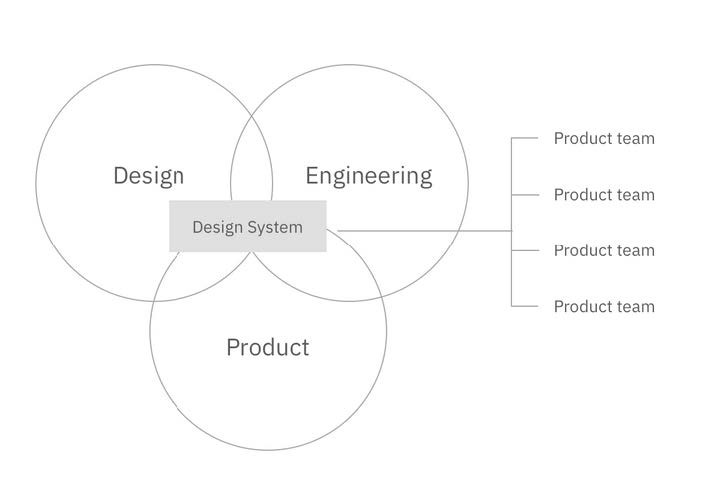

### Distributed Model

- No centralized core team
Built & maintained by the consuming
teams
- Instills a sense of ownership
- Influenced by many vantage points
Less down time

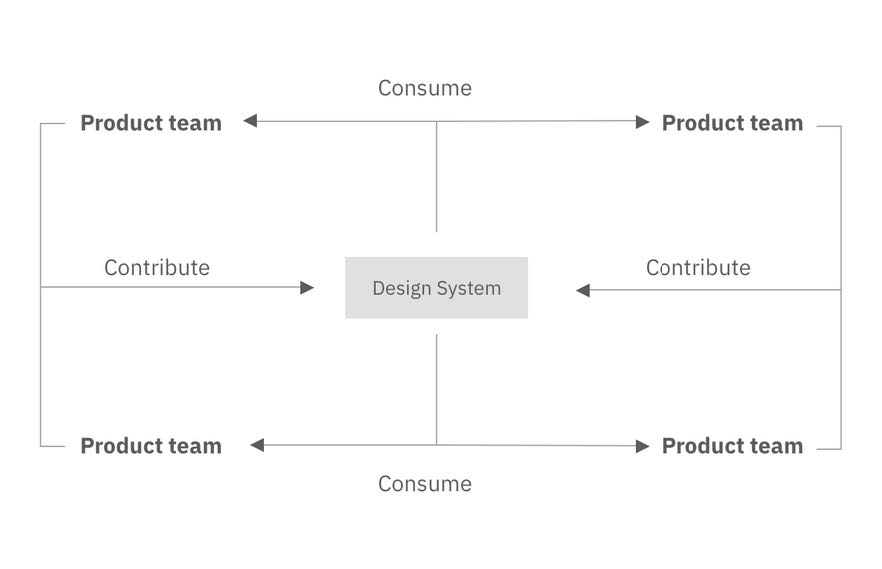

### Hybrid Model

- Combines the centralized and
distributed models
- Decisions are made quickly

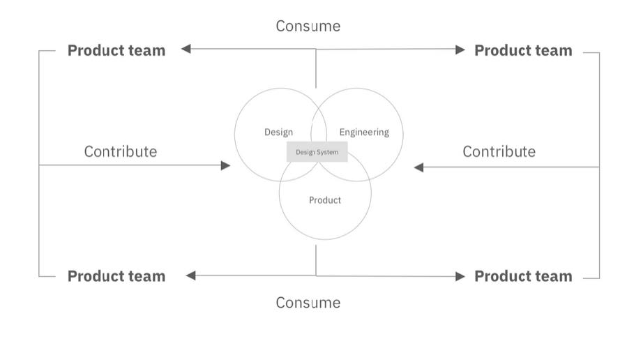

## 4. Who are Design Systems For_

“If a design system is by a company,
then it’s for the company. It might also
be open source, but any ol’ random
developer who wants to use it isn’t the
target audience.”

- Chris Coyier

## 5. A Practical Example

[And You Thought
Buttons Were Easy...](https://medium.com/eightshapes-llc/and-you-thought-buttons-were-easy-26eb5b5c1871)

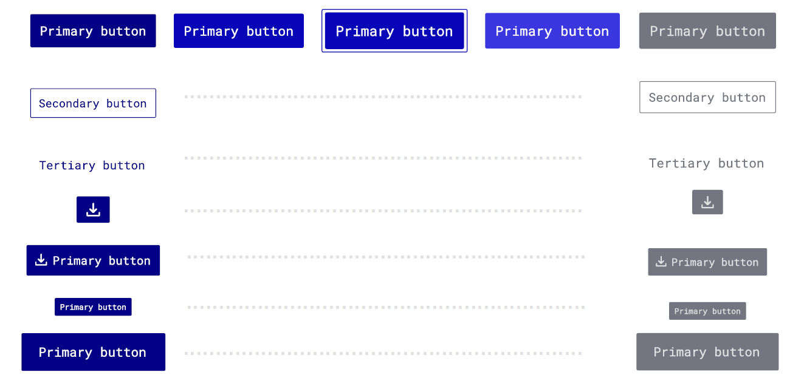
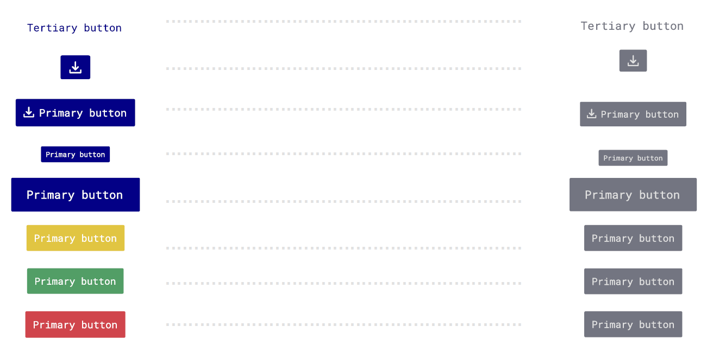

### How many buttons is that?

- 3 default buttons (primary, secondary, tertiary)

- 3 status buttons (error, warning, status)

- 4 status icon buttons

- 4 default + icon buttons

14 buttons X 5 states (i.e. hover) X 2 sizes

= 140 button combinations per theme...

## 6. The Three Pillars of Design Systems

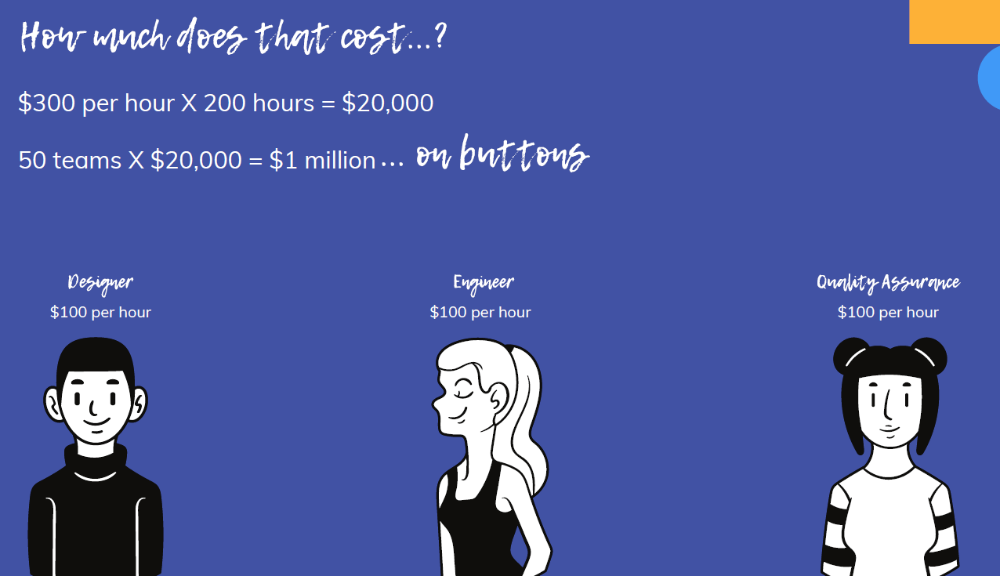

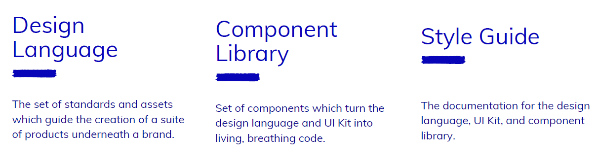

### Design Language

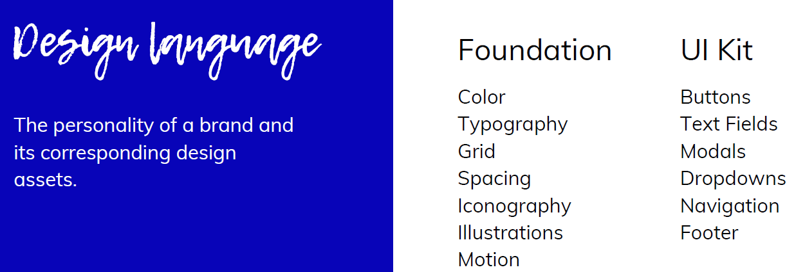

### Component Library

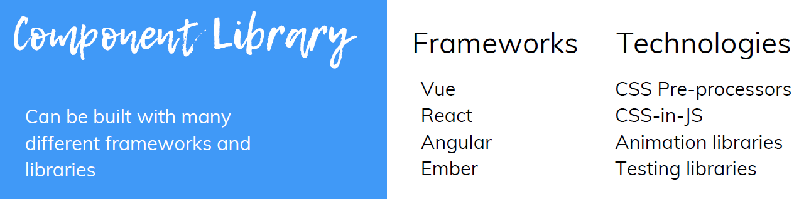

### Style Guide

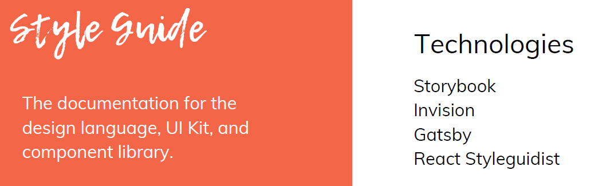

## 7. Building a Design System

1. Define your design principles
2. Conduct a UI audit
3. Create your checklists
4. Define your workflows

### Define your design principles

Design principles are the grounding
values which drive the creation of your
products.

What do you want your users to feel
when using your product?

"Bold, optimistic, and practical."

### Conduct a UI audit

Compile all components, in every
variation and state, in one place.

Group these components by
functionality.

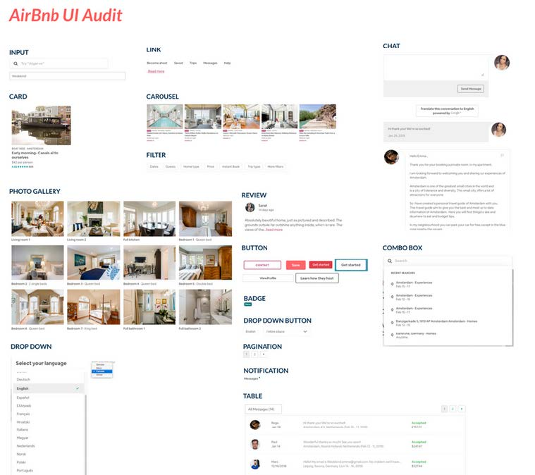

Prioritize the components which
have the highest impact on

unification of your products and are
easily achievable.

#### Prioritizing components

- Does this request embody our design principles?
- Does this request require a lot of design/development effort?
- Does this request come with a high risk to the success of our
product?
- Does this request coincide with the product roadmap?
- Does this request improve the user experience of our
products?
- Are we confident in this request or will it need to be revisited
in the near future?
- Is this request technically feasible?

### metrics

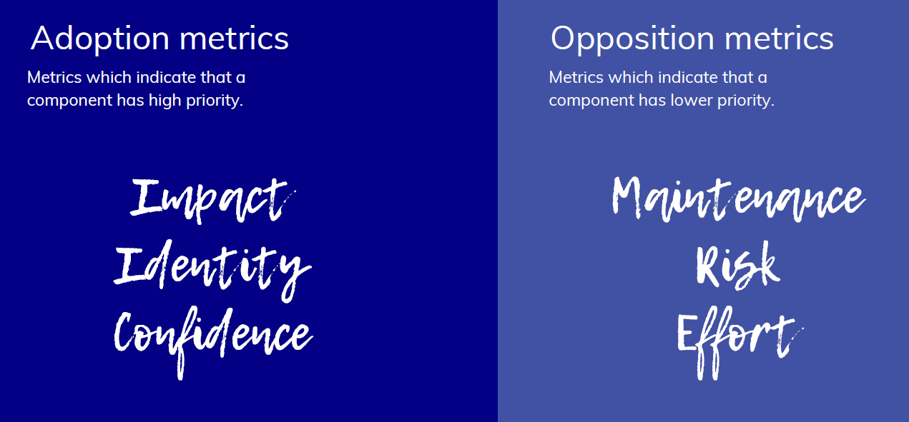

### Calculating priority

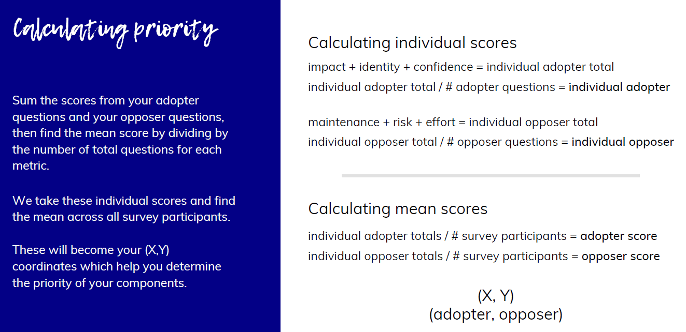

### Prioritizing components

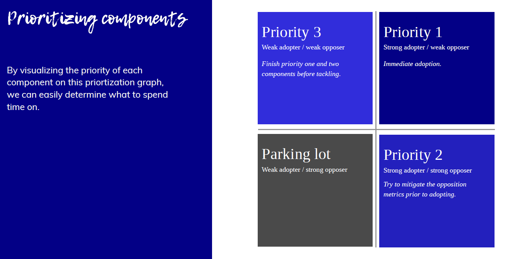

### Buttons

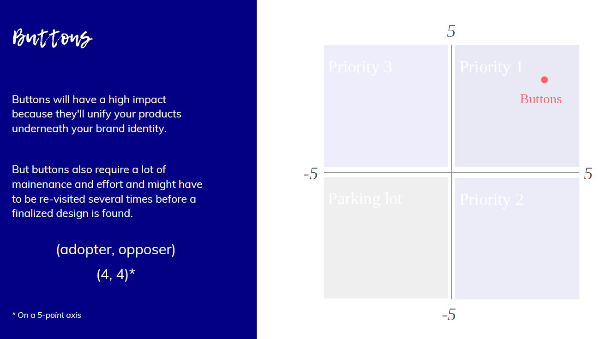

### Accordions

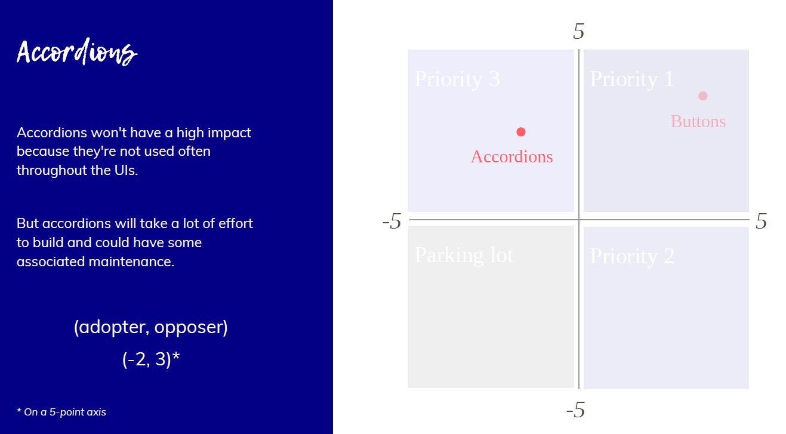

### Create your checklists

### Define your workflows

## 8. Design System Checklist

## 9. Common Mistakes
