# [DESIGN SYSTEMS Home Page 🏠](../../README.MD)

- [DESIGN SYSTEMS Home Page 🏠](#design-systems-home-page-)
  - [Foundations of Design](#foundations-of-design)
    - [Color Overview](#color-overview)
      - [Color](#color)
      - [Color Mixing](#color-mixing)
      - [Additive Color Mixing (RGB)](#additive-color-mixing-rgb)
      - [Subtractive Color Mixing (CYMK)](#subtractive-color-mixing-cymk)
    - [Color types](#color-types)
      - [Primary Colors](#primary-colors)
      - [Secondary Colors](#secondary-colors)
      - [Tertiary Colors](#tertiary-colors)
    - [Color palettes](#color-palettes)
      - [Monochromatic](#monochromatic)
      - [Complementary](#complementary)
      - [Analogous](#analogous)
      - [Triadic](#triadic)
    - [2. Color Terminology](#2-color-terminology)
      - [Hue](#hue)
      - [Saturation](#saturation)
      - [Luminance](#luminance)
      - [Shade](#shade)
      - [Tint](#tint)
      - [Tone](#tone)
    - [3. Color Semantics](#3-color-semantics)
    - [4. Color Values](#4-color-values)
    - [5. Creating a Color Palette](#5-creating-a-color-palette)
    - [6. Color Palette Practice](#6-color-palette-practice)
    - [7. Typography](#7-typography)
    - [8. Fonts](#8-fonts)
    - [9. Typescale](#9-typescale)
    - [10. Typescale Exercise](#10-typescale-exercise)
    - [11. Typescale Solution](#11-typescale-solution)
    - [12. Other Areas of Design](#12-other-areas-of-design)

## Foundations of Design

### Color Overview

#### Color

Before we can code our component library we have to design some of the foundational elements of our design system.

Color is one of the most important foundational elements of a design system and impacts every single component.

Color theory is the combination of art and science that's used to determine how colors interact.

#### Color Mixing

There are two methods for producing colors: additive and subtractive.

Additive color mixing, also known as RGB, is carried out by mixing different amounts of primary colors such as red, green, and blue to produce secondary colors, yellow, cyan, and magenta.

Subtractive color mixing is used when white light reflects off of an object.

#### Additive Color Mixing (RGB)

Additive colors start black and become white as more red, blue, or green are added.

TVs and computer monitors use additive color mixing. Every pixel begins as black and express color as a percentage of red, green, and blue.

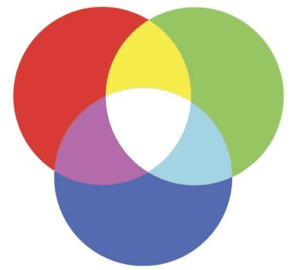

#### Subtractive Color Mixing (CYMK)

While additive color mixing is created by adding colored light to black, subtractive colors are created by absorbing (subtracting) some light wavelengths and reflecting others.

Subtractive colors start as white and as filters are added takes on the appearance of color.

Photos and magazines use subtractive colors.

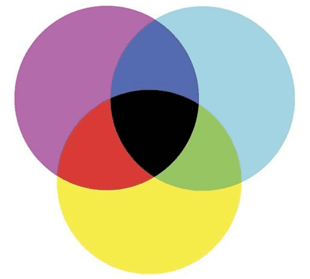

### Color types

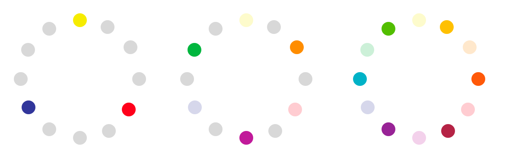

#### Primary Colors

In the RYB color wheel primary colors are colors which cannot be created by combining other colors. These are red, yellow, and blue.

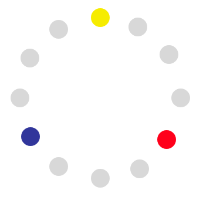

#### Secondary Colors

Secondary colors result from mixing two primary colors. In the RGB color wheel, secondary colors are cyan, magenta, and yellow.

In the RYB color wheel the secondary colors are purple, orange, and green.

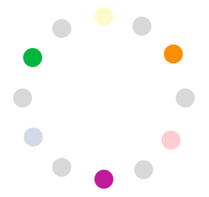

#### Tertiary Colors

Tertiary colors are created by combining a secondary color with a primary color. There are six tertiary colors.

The tertiary colors are red-orange, yellow-orange, yellow-green, blue-green, blue-violet, and red-violet.

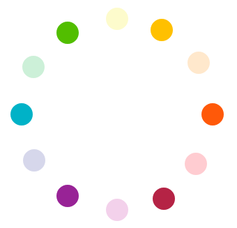

### Color palettes  

There are several types of color combinations which can be used to build color palettes.

#### Monochromatic

Monochromatic palettes are created by establishing variations on a shade of a single color.

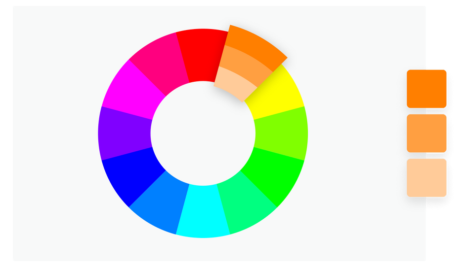

#### Complementary

Complementary color palettes are created by selecting two colors directly opposite of each other on the color wheel.

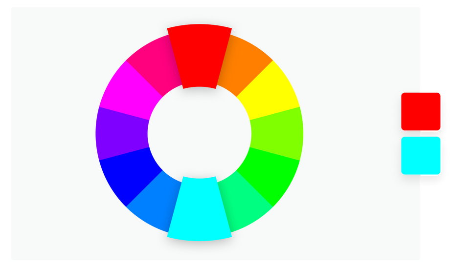

#### Analogous

Analogous color palettes are created by selecting three colors which are side by side on the color wheel.

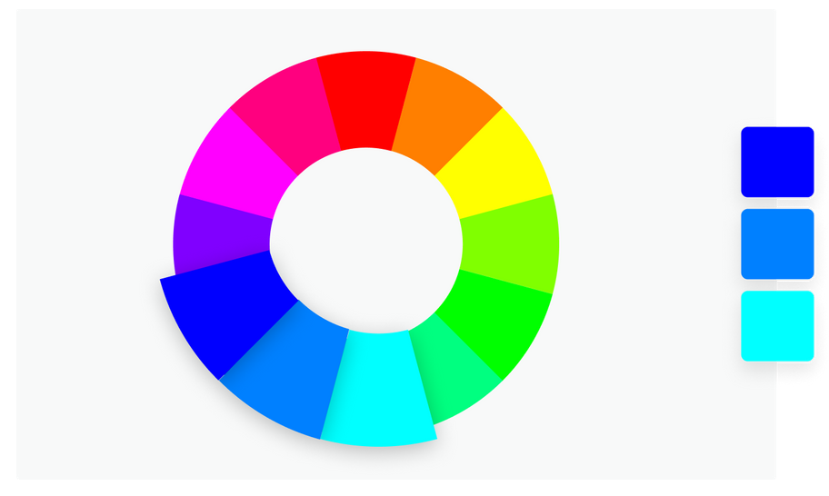

#### Triadic

Triadic color palettes are created by selecting three evenly-spaced colors from around the color wheel.

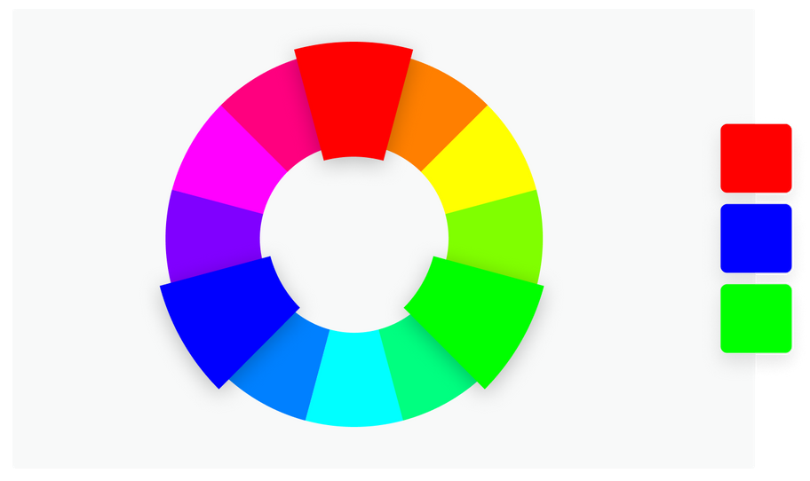

### 2. Color Terminology

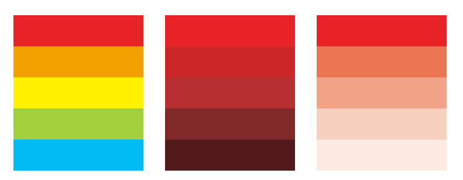

#### Hue

A hue is any color on the color wheel. Variations on this hue are created by establishing a shade, tint, or tone.

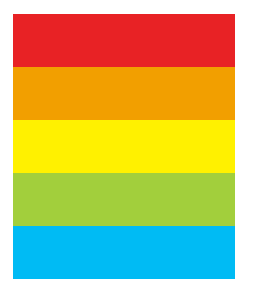

#### Saturation

Saturation is the intensity or purity of a color.

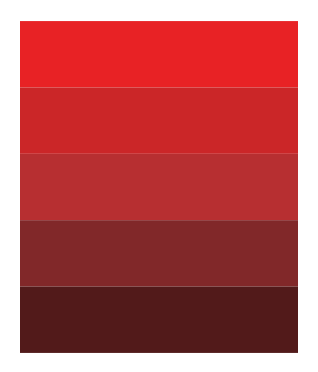

#### Luminance

Luminance is the amount of brightness, or light, in a color.

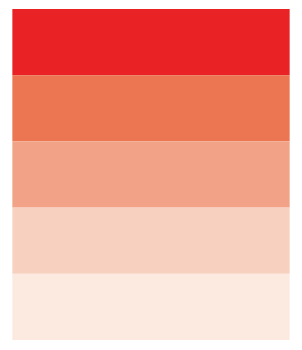

#### Shade

A shade is created by incorporating black to a base hue, which darkens the color.

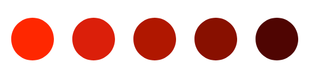

#### Tint

A tint is created by adding white to a base hue, which lightens the color.

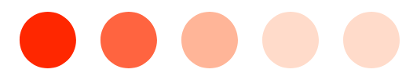

#### Tone

A tone is created by combining black or white (gray) with a base hue. Tones are subtle variations of the original color.

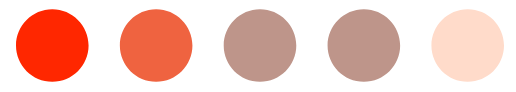

####

### 3. Color Semantics

### 4. Color Values

### 5. Creating a Color Palette

### 6. Color Palette Practice

### 7. Typography

### 8. Fonts

### 9. Typescale

### 10. Typescale Exercise

### 11. Typescale Solution

### 12. Other Areas of Design
